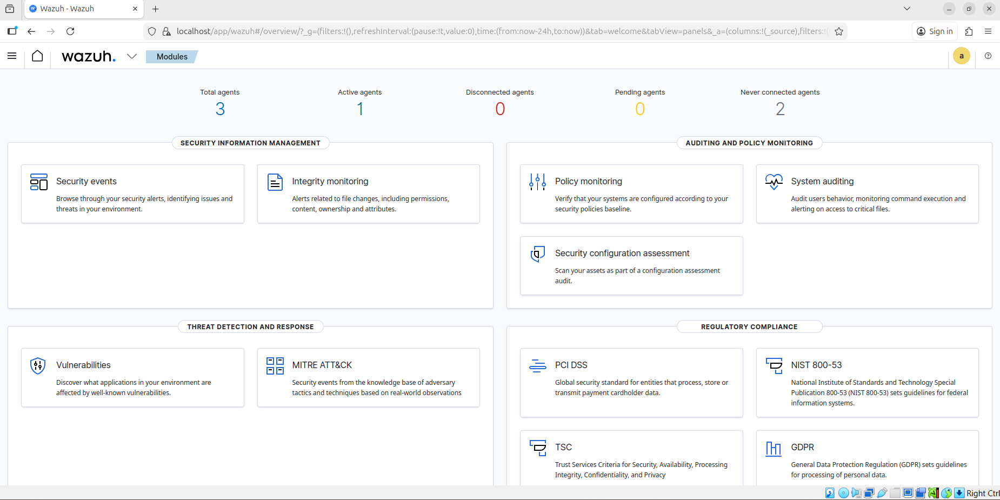
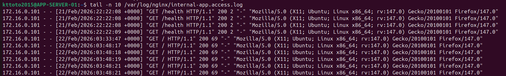
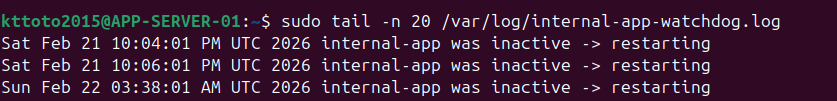
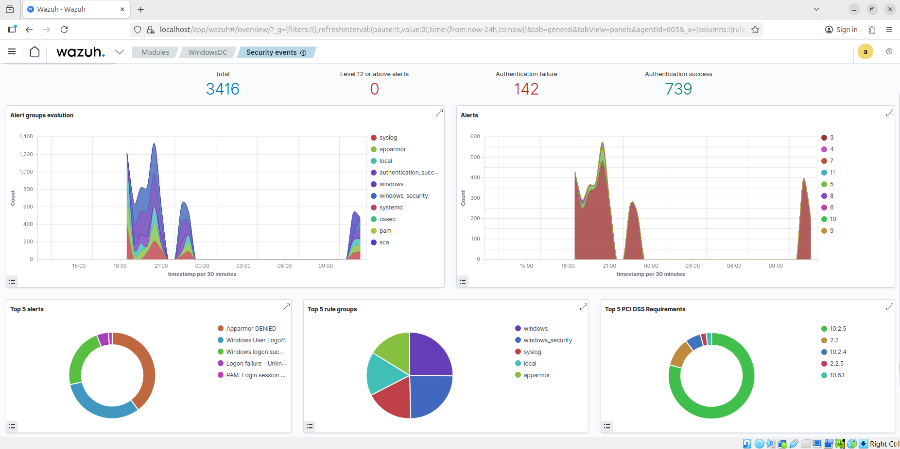

This project is a hands on Security Operations Center home lab that I built to simulate real world monitoring, log ingestion, and detection and response techniques.
The lab uses Wazuh as a SIEM and Windows and Linux endpoints as well as a Kali Linux machine to simulate an outside attacker. The environment evolved into a multi-tier application architecture including an internal web application and a dedicated database server to simulate real production dependency monitoring and troubleshooting workflows.

Environment
- Ubuntu Linux (Wazuh manager and Dashboard)
- Windows Server - Domain Controller
- Windows 10 - User Endpoint
- Kali Linux - Outside Attacker
- Ubuntu Server - Internal App Server(Flask app)
- Ubuntu Server - Database Server(PostgreSQL)

Telemetry Sources
Windows Event Logs
Sysmon(Process + Network Telemetry)
Linux syslog
Authentication events
Nginx access + error logs
Custom automation logs (watchdog restart log)

Objective
- Monitor authentication, endpoint activity, and directory changes
- Detect common attacker techniques
- Proactice SOC-style triage and response
- Practice troubleshooting internal application outages using custom logs
- Create simple automation to reduce downtime on services 

Implementation Process
Wazuh SIEM Deployment 
- I began on my Ubuntu machine where I downloaded and configured Wazuh Manager, Indexer, and Dashboard
- I then enrolled Wazuh agents on the Windows Server DC, Windows 10, and Ubuntu machines.
- Resolved agent erollent issues I had like duplicate names and connectivity issues.
- Verified persistent agent connectivity to the manager
Image of Agents configured to the dashboard 

Windows Enpoint Telemetry(Sysmon)
- Installed Sysmon on Windows endpoints
- Troubleshot Sysmon configuration to make sure that important events were being logged such as proccess creations and network connections (Event ID1, ID3)
- validated sysmon first locally using wevtutil
- Confirmed Wazuh agent was ingesting Sysmon logs

Internal Application Server 
- Built a new Ubuntu server to act as an internal production application host
- Deployed a simple Flask app and ran it as a systemd service (internal-app.service)
- Added Nginx reverse proxy so the app is available on port 80
- Created Nginx access and error logs
- Added a Wazuh agent on the app server
- Configures the Wazuh agent to take in all Nginx access and error logs to display on the Wazuh dashboard to make it easy to troubleshoot

Nginx Logs

Database Tier Deployment (postgreSQL)
- Built a dedicated Ubuntu database VM to add in a backend dependency for the internal application
- Installed and configured postgreSQL as the primary database engine
- Configured postgreSQL allowing for remote connections so I could connect in with the application server
- updated listening addresses and pg_hba.conf to support authenticated connections from internal subnet
- Checked connectivity from the app server
Purpose - The purpose of the databse addition was to try and best reflect a real enterpise environment

Automation/Self-correction(Watchdog)
- Wrote a watchdog script that checks if the interal app service went down and if it is, automatically restarts it
- Scheduled the watchdog with a root cron job that runs every 2 minutes
- Logged all the restart actions to /var/log/internal-app-watchdog.log
- Configured Wazuh agent to ingest the watchdog log so all restarts and service outages will show up in the Wazuh dashboard
- Tested this by manually stopping the internal-app service and confirmed how the watchdog script restarted the servoce and how it was all logged and showed up in Wazuh

  
  
  Service Health Monitoring
  - On the application server I created a custom health cheching script to check the availability of the internal app and its database
  - I scheduled script - app_healthcheck.sh to run every minute via cron which calls the /health endpoint of the flask application that recoded:
                      - Timestamp
                      - HTTP status code
                      - Overall service and database connectivity status(OK/FAIL)
  - Updated the Flask /health endpoint to have a database connectivity check
  - Allows the monitoring system to find service degredation even if the app process is still running. 

Current Attack Simulation
- Used Kali Linux to simulate sttacker activity
  - Port scans(Nmap)
  - Connection attempts(SMB, RDP, HTTP) with incorrect credentials to simulate a password spray      attack
- Generated detectable network activity through real TCP connections

Then confirmed that events from endpoints were properly being logged and aggregated at the Wazuh Dashboard
Here is an image from the dashboard looking at the security events for the Windows DC endpoint. You can see all of the different invalid login attempts that I simulated from the Kali Linux machine.

Incident Simmulation - Dependency Failure(Database Outage)
- This icident was a controlled scenario that I ran just to ensure that my database and internal-app monitoring were working as I intended them to.
- Scenario: The Database VM has been powered off
- Observed Behavior:
    - The /health endpoint now returned HTTP 500 errors
    - My monitoring script began logging FAIL events every minute via cron job
    - Nginx 500 alerts triggered
- Resolution
  - Database VM turned back on
  - Healthmonitoring checks went back to returning OK
  - Monitoring confirmed the recovery

Next Planned Enhancements
- Add custom Wazuh rules to detect common attack vectors
- Noise reduction and alert tuning
- Integration of Suricata for network-based IDS detection
- MITRE ATT&CK mapping for detected activity
- Automation of common response techniques and workflows
