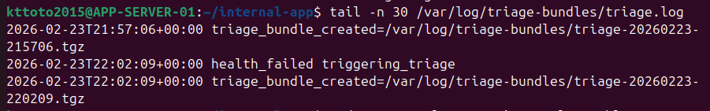

Project Overview

This project is a hands-on Security Operations Center (SOC) home lab designed to simulate real-world monitoring, log ingestion, incident detection, and operational troubleshooting workflows.

The environment combines endpoint telemetry, centralized SIEM monitoring, and a multi-tier application architecture to mirror how production systems are monitored and supported. In addition to traditional security visibility, the lab focuses heavily on service reliability, dependency monitoring, controlled incident simulation, and operational automation.

The lab uses Wazuh as the SIEM platform, Windows and Linux endpoints for telemetry, and a Kali Linux machine to simulate external attacker behavior. The environment evolved into a production-style architecture that includes an internal web application and a dedicated database server, enabling realistic monitoring of service dependencies and outage scenarios.

Architecture Overview 

Core Architecture 
Ubuntu Linux — Wazuh Manager, Indexer, and Dashboard
Windows Server — Domain Controller
Windows 10 — User Endpoint
Kali Linux — External attacker simulation
Ubuntu Server — Internal Application Server (Flask + Nginx)
Ubuntu Server — Database Server (PostgreSQL)

Telemetry Sources
Windows Event Logs
Sysmon (process and network telemetry)
Linux syslog
Authentication events (domain + local)
Nginx access and error logs
Application health monitoring logs
Watchdog automation logs
Deployment and triage automation logs

Objectives
Monitor authentication activity, endpoint behavior, and directory changes
Detect attacker techniques using real telemetry
Practice SOC-style triage and investigation workflows
Practice troubleshooting internal application outages and dependency failures
Implement automation to reduce downtime and accelerate recovery
Simulate production support responsibilities (deployments, monitoring, escalation)

Implementation Process
Wazuh SIEM Deployment
Installed and configured Wazuh Manager, Indexer, and Dashboard on Ubuntu
Enrolled agents on Windows Server, Windows 10, and Linux systems
Troubleshot agent enrollment issues including duplicate names and connectivity problems
Verified persistent agent connectivity and log ingestion 

Windows Endpoint Telemetry (Sysmon)
Installed Sysmon on Windows endpoints
Configured Sysmon to capture high-value telemetry such as:
  - Process creation (Event ID 1)
  - Network connections (Event ID 3)
Validated Sysmon locally using wevtutil before forwarding
Confirmed ingestion into Wazuh dashboard

Internal Application Architecture (Production Simulation)
Application Server (Blue/Green Deployment + Reverse Proxy)

Built an Ubuntu application server hosting a Flask web application
Implemented a strict /health endpoint that validates database connectivity
Deployed the application using blue/green systemd services:
  - internal-app-blue (port 5000)
  - internal-app-green (port 5001)
Configured Nginx reverse proxy to provide a stable front-door endpoint on port 80
Implemented Nginx upstream routing to switch production traffic between blue and green backends without client impact
Created a deployment/rollback script (switch-app.sh) that:
  - Performs health validation before switching traffic
  - Updates the active upstream
  - Reloads Nginx safely
  - Logs all deployment actions
Added a Wazuh agent to ingest Nginx logs for operational visibility

Nginx Logs

Database Tier Deployment (PostgreSQL)
Built a dedicated Ubuntu database VM to introduce a backend dependency
Installed and configured PostgreSQL as the application datastore
Enabled secure remote connections from the application server
Updated listen_addresses and pg_hba.conf to support authenticated internal access
Verified connectivity from the application server
Purpose: introduce realistic service dependency monitoring and failure scenarios.

Automation and Reliability Engineering
Service Recovery Automation (Watchdog)

Developed a watchdog script to monitor critical services (Nginx + application services)
Automatically restarts services if they become inactive
Scheduled execution via cron
Logged restart activity to /var/log/internal-app-watchdog.log
Configured Wazuh to ingest watchdog logs for visibility into service outages and recovery actions
Tested by intentionally stopping services and validating automatic recovery

  
Service Health Monitoring
Created a custom health monitoring script that calls the application /health endpoint
Scheduled checks via cron every minute
Logged:
  - Timestamp
  - HTTP status code
  - Overall service and dependency health (OK / FAIL)
Designed monitoring to detect degradation even when the application process is still running

Escalation Triage Automation
Built a triage bundle script that collects diagnostic data when health checks fail
Captures:
  - Service status snapshots
  - Active Nginx upstream configuration
  - Recent journal logs
  - Network connectivity checks
  - Stores bundles under /var/log/triage-bundles/ to simulate L2 escalation workflows
Added cooldown logic to prevent alert/triage noise

KPI & Metrics Engine
Built a custom metrics aggregation engine:
Generates:
24h Uptime %
Total health checks
OK / FAIL count
MTTR (Mean Time To Recovery)
Auto restarts (24h)
Severity score (0–100)
30-minute anomaly detection window
All metrics are exported as structured JSON and served via Nginx to a real-time dashboard.

AI-Style Operational Insights Engine
Implemented a lightweight inference layer that:
Detects restart storms
Identifies flapping behavior
Evaluates SLO compliance
Scores system risk (severity index)
Generates:
Insights
Likely causes
Recommended actions
This simulates intelligent ITSI-style monitoring and automation workflows.

Attack Simulation
Used Kali Linux to simulate attacker activity:
  - Network scanning (Nmap)
  - Authentication attempts (SMB, RDP, HTTP)
  - Password spray style login attempts
Generated real network telemetry and authentication failures
Confirmed detection and aggregation within Wazuh

Incident Simulation — Dependency Failure (Database Outage)
  - Conducted a controlled database outage scenario
  - Powered off the database VM to simulate dependency failure
Observed behavior:
  - Application /health endpoint returned HTTP 500
  - Monitoring logged FAIL events continuously
  - Nginx surfaced upstream errors
  - Triage bundle automation captured diagnostic evidence
Resolution:
  - Restored database service
  - Health checks returned to OK
  - Monitoring confirmed recovery
This scenario validated dependency monitoring, detection, and recovery workflows.

Next Planned Enhancements
Custom Wazuh detection rules for attacker techniques
Alert tuning and noise reduction
Suricata integration for network IDS visibility
MITRE ATT&CK mapping for detections
Automated response playbooks
Additional deployment automation scenarios
